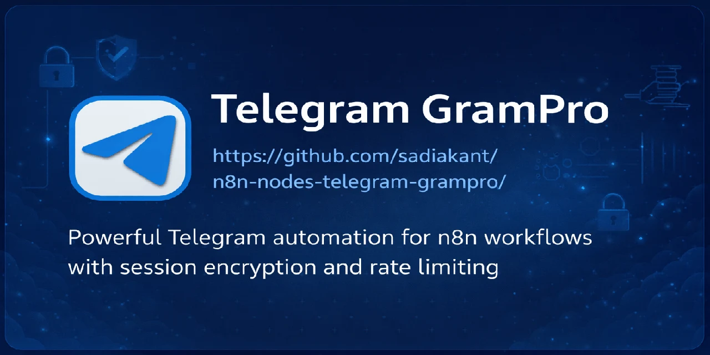

# Telegram GramPro - n8n Integration

**Powerful Telegram automation for n8n workflows with enterprise-grade security, performance optimization, and comprehensive error handling**

<h4 align="center"> Join Our Telegram Group for Help and Support</h4>
<p align="center"> 
  <a href="https://t.me/n8n_nodes_0">
    
  </a>
</p>

## 🚀 Transform Your Telegram Automation

Telegram GramPro is a comprehensive n8n custom node that brings the full power of Telegram's MTProto protocol to your automation workflows. Built with GramJS and designed for production use, it offers enterprise-grade features with an intuitive interface.

### 🌟 **Key Features**

#### **Core Operations**

- **Messages**: Send, get messages (time-based filters), edit, delete, pin, forward, copy, create polls and quizzes
- **Chats**: Get chats, dialogs, join/leave, create groups/channels
- **Users**: Get user info, full details with bio and common chats, update profile, change username, get profile photos
- **Media**: Download media files with progress tracking
- **Channels**: Get participants, manage members, ban/promote users

#### **Enterprise Security & Performance**

- 🔐 **AES-256-GCM Session Encryption** - Military-grade security with automatic key derivation
- ⚡ **Smart Rate Limiting** - Prevents API limits with intelligent queuing and priority handling
- 🛡️ **Enhanced Error Handling** - Automatic retry for flood waits, timeouts, and connection issues
- 🔗 **Connection Management** - Advanced client pooling with health checks and auto-reconnection
- 📊 **Structured Logging** - Production-ready logging with configurable levels and context
- 🧠 **Smart Caching** - In-memory caching for frequently accessed data with TTL management
- 🎯 **Input Validation** - Comprehensive validation with detailed error messages and warnings

#### **New Advanced Features**

- **Copy Restricted Content** - Handle media that cannot be forwarded normally
- **Edit Message Media** - Update media content in existing messages with caption support
- **Enhanced Authentication** - Improved session management with better error handling
- **Memory Optimization** - Automatic cleanup and resource management
- **Performance Monitoring** - Built-in metrics and queue monitoring

## 📦 Installation

### Method 1: n8n Community Nodes (Recommended)

1. Open n8n UI
2. Go to **Settings** → **Community Nodes**
3. Add in box "n8n-nodes-telegram-grampro"
4. Click checkbox to allow to use external nodes.
5. Click **Install**
6. Restart n8n to load the custom node

> **Note:** If you have trouble updating the node in the n8n UI, uninstall (remove) the GramPro node first, then perform a fresh install to resolve the issue.

### Method 2: Custom Nodes Directory

1. **Clone to n8n custom nodes directory**
2. **Install dependencies**
   ```bash
   npm install
   ```
3. **Build the project**
   ```bash
   npm run build
   ```
4. **Restart n8n** to load the custom node

### Method 3: GitHub Installation

1. **Clone from GitHub**
   ```bash
   git clone https://github.com/sadiakant/n8n-nodes-telegram-grampro.git
   ```
2. **Move to n8n custom nodes directory**
3. **Install dependencies**
   ```bash
   npm install
   ```
4. **Build the project**
   ```bash
   npm run build
   ```
5. **Restart n8n** to load the custom node

## ⚙️ Quick Setup

### 1. Get API Credentials

- Visit [my.telegram.org](https://my.telegram.org)
- Create new application
- Note your **API ID** and **API Hash**

### 2. Create Session String

Use our built-in authentication operations. For detailed step-by-step instructions, see our [Authorization Guide](./docs/AUTHORIZATION_GUIDE.md).

### 3. Configure Credentials

In n8n → Settings → Credentials:

- **API ID**: Your Telegram API ID
- **API Hash**: Your Telegram API hash
- **Session String**: Your encrypted session string
- **Mobile Number**: Your Telegram mobile number with country code (e.g., +1234567890)
- **Validation**: Save/Test performs real MTProto getMe verification.
- **UI Note**: n8n may still show the generic label Connection tested successfully on the global credentials page.

## 🎯 Comprehensive Operations Guide

For detailed documentation of all operations with parameters, examples, and use cases, see our [Operations Guide](./docs/OPERATIONS_GUIDE.md).

## Latest Release Highlights

This release finalizes the GramPro user-account trigger and aligns media handling across the node.

- New `Telegram GramPro Trigger` for Telegram user accounts using a persistent MTProto listener
- Published workflow support for `Message` and `Edited Message` trigger events
- `Listening Mode` multi-select with `Incoming Messages` and `Outgoing Messages`
- Trigger filters: `All Messages`, `Only User Messages`, `Only Channel Messages`, `Only Group Messages`, `Selected Chats Only`, `Except Selected Chats Only`
- Selected/excluded chat matching by username, title, sender name, sender ID, chat ID, and equivalent numeric aliases
- Auto binary download in trigger output for `photo`, `video`, and `document`
- Improved trigger cleanup and shared client reuse to prevent stale MTProto timeout logs
- `Media Type` support aligned to `text`, `photo`, `video`, `document`, `other`
- `Send Message` now treats `mediaType = text` as plain text without requiring binary data
- `Get Chat History` can filter by the same trigger-compatible message/media types

## 🔧 Available Operations

| Resource              | Operations                                                                                                  |
| --------------------- | ----------------------------------------------------------------------------------------------------------- |
| **Auth**              | Request Login Code, Resend Login Code, Sign in, Request QR Login, Complete QR Login                         |
| **Message**           | Send Message, Get Chat History, Edit, Delete, Pin, Forward, Copy, Edit Media, Create Poll, Copy Restricted Content, Clear History, Unpin Message |
| **Chat**              | Get Chat Info, Get Chats List, Join Channel/Group, Leave Channel/Group, Create Group/Channel                |
| **User**              | Get My Profile, Get Profiles Photo, Update My Profile, Update My Username, Get User Profile (Bio & Common Chats) |
| **Media**             | Download Media Files                                                                                        |
| **Channel**           | Add Member, Remove Member, Ban User, Unban User, Promote to Admin, Get Members                              |

## Trigger Improvements

Telegram GramPro now provides one MTProto trigger node:

- `Telegram GramPro Trigger` (`telegramGramProTrigger`)

Unlike the official n8n Telegram bot trigger, Telegram user accounts cannot register Bot API webhooks. GramPro keeps a live MTProto session connected while the workflow is active.

Supported updates:

- `Message`
- `Edited Message`

Listening mode:
- `Incoming Messages`
- `Outgoing Messages`
- Selecting both listens to both directions

Trigger filters:
- `All Messages`
- `Only User Messages`
- `Only Channel Messages`
- `Only Group Messages`
- `Selected Chats Only`
- `Except Selected Chats Only`

Filter behavior:
- `All Messages` is the default catch-all mode
- `Only Channel Messages` matches broadcast channels only
- `Only Group Messages` matches classic groups plus supergroups/gigagroups
- `Selected Chats Only` matches chat or sender identifiers from a JSON array or comma-separated list
- `Except Selected Chats Only` excludes matching chats or senders after the main include filter is applied
- Numeric IDs are matched across equivalent forms such as `519...`, `-519...`, and `-100519...`
- `Selected Chats Only` and the per-type include toggles are mutually exclusive in the UI to avoid hidden-value overwrite issues

Trigger output is readable-only (`raw` removed) and includes:
- `updateType`, `message`, `date` (ISO UTC), `editDate`, `chatName`, `chatId`, `chatType`, `senderName`, `senderId`, `senderIsBot`, `messageId`
- `isPrivate`, `isGroup`, `isChannel`, `isOutgoing`, `messageType` (`text`, `photo`, `video`, `document`, `other`)

Binary output behavior:
- For `photo`, `video`, and `document`, media is attached in `binary.data`
- If media download fails, JSON is still emitted with `mediaDownloadError`

## 🛡️ Security Features

### **Session Encryption**

All session strings are automatically encrypted using AES-256-GCM with:

- 256-bit encryption keys derived from your API credentials
- 128-bit initialization vectors with PBKDF2 key derivation
- Authentication tags for integrity verification
- Automatic encryption/decryption transparent to users
- Secure storage prevents session exposure

### **Input Validation**

Comprehensive validation ensures data integrity and security:

- API credentials validation (ID format, Hash length)
- Phone number format validation (international format)
- Session string validation and integrity checks
- Operation-specific parameter validation
- Real-time warnings for potential issues

### **Enhanced Error Handling**

The node handles common Telegram errors gracefully:

- **FLOOD_WAIT**: Automatic retry with specified wait time
- **AUTH_KEY_DUPLICATED**: Clear error message about session conflicts
- **SESSION_REVOKED**: Guidance to re-authenticate
- **USER_DEACTIVATED_BAN**: Account ban detection
- **PEER_FLOOD**: Extended wait times for peer flooding
- **NETWORK_TIMEOUT**: Exponential backoff retries (up to 5 attempts)
- **CHAT_WRITE_FORBIDDEN**: Permission error handling
- **USER_BANNED_IN_CHANNEL**: Channel ban detection
- **AUTH_KEY_UNREGISTERED**: Session is invalid or expired and must be regenerated
- **SESSION_EXPIRED**: Session expired and must be renewed
- **USER_PRIVACY_RESTRICTED**: Action blocked by user privacy settings
- **CHANNEL_PRIVATE**: Channel or group is private/inaccessible
- **USERNAME_NOT_OCCUPIED / USERNAME_INVALID**: Username does not exist or has invalid format
- **INVITE_HASH_INVALID / INVITE_HASH_EXPIRED**: Invite link is invalid or expired
- **PEER_ID_INVALID / MESSAGE_ID_INVALID**: Chat/message identifiers are invalid

## ⚡ Performance Optimizations

### **Smart Client Management**

- **Connection Pooling**: Reuses existing TelegramClient instances via Map cache
- **Race Condition Prevention**: Connection locks prevent multiple simultaneous connections
- **Health Monitoring**: Automatic connection validation and healing
- **Auto-cleanup**: 30-minute stale connection detection and cleanup
- **Reconnection Logic**: Automatic reconnection for failed connections
- **Session Encryption**: Transparent AES-256-GCM session decryption

### **Intelligent Rate Limiting**

- Configurable request intervals (minimum 1-second)
- Priority-based request queuing with queue length monitoring
- DoS protection with maximum queue size limits (1000 requests)
- Automatic cleanup of stale requests
- Enhanced Telegram API limit compliance

### **Smart Caching**

In-memory caching for frequently accessed data:

- User information caching (5-minute TTL)
- Chat/channel metadata caching
- Dialog lists caching
- Automatic cache cleanup and size management
- Configurable cache TTL and maximum size

### **Memory Efficient Design**

- Proper cleanup prevents memory leaks
- Connection pooling and resource management
- Background loop prevention
- Optimized data structures and algorithms
- Automatic resource cleanup

### **Enhanced Request Handling**

- **Binary File Upload**: Support for text-aware send flows plus photos, videos, documents, and other file types where applicable
- **Media URL Support**: Direct URL upload with fallback to download-and-upload
- **Progress Tracking**: Real-time download progress for large media files
- **Error Recovery**: Automatic retry for network timeouts and connection issues

## 🚨 Troubleshooting

For comprehensive troubleshooting guidance, common issues, and solutions, see our [Troubleshooting Guide](./docs/TROUBLESHOOTING_GUIDE.md).

## Project Structure

```
n8n-nodes-telegram-grampro/
├── 📄 Root Files
│   ├── .gitignore, .prettierrc.js, eslint.config.mjs
│   ├── LICENSE, README.md
│   ├── package.json, package-lock.json
│   └── tsconfig.json
│
├── 🐙 .github/
│   ├── CODE_OF_CONDUCT.md, CONTRIBUTING.md, SECURITY.md
│   └── workflows/
│       ├── build.yml
│       └── publish.yml
│
├── 🔐 credentials/
│   ├── TelegramGramProApi.credentials.ts
│   └── telegram-grampro-credentials.svg
│
├── 📚 docs/
│   ├── AUTHORIZATION_GUIDE.md
│   ├── OPERATIONS_GUIDE.md
│   └── TROUBLESHOOTING_GUIDE.md
│
└── ⚡ nodes/
    ├── 📦 TelegramGramPro/
    │   ├── TelegramGramPro.node.ts
    │   ├── telegram-grampro.svg
    │   ├── core/
    │   │   ├── cache.ts, clientManager.ts, floodWaitHandler.ts
    │   │   ├── logger.ts, operationHelpers.ts, qrPng.ts
    │   │   ├── rateLimiter.ts, sessionEncryption.ts
    │   │   ├── telegramErrorMapper.ts, validation.ts
    │   │   └── types.ts, messageFormatting.ts
    │   └── resources/
    │       ├── authentication.operations.ts
    │       ├── channel.operations.ts
    │       ├── chat.operations.ts
    │       ├── media.operations.ts
    │       ├── message.operations.ts
    │       └── user.operations.ts
    │
    └── 🔔 TelegramGramProTrigger/
        ├── TelegramGramProTrigger.node.ts
        ├── trigger.shared.ts
        └── telegram-grampro.svg
```

## Workflow Examples

Ready-to-import workflow examples are available in [`docs/Workflows-Examples`](./docs/Workflows-Examples):

- [`Send messages from one user to multiple users.json`](./docs/Workflows-Examples/Send%20messages%20from%20one%20user%20to%20multiple%20users.json)
- [`Send messages from folder chats to user.json`](./docs/Workflows-Examples/Send%20messages%20from%20folder%20chats%20to%20user.json)

### How to Import in n8n

1. Open n8n and create a new workflow.
2. Use the workflow menu and select **Import from File**.
3. Choose one of the JSON files from `docs/Workflows-Examples/`.
4. Re-map `telegramGramProApi` credentials to your own Telegram GramPro credential.
5. Replace placeholders such as source/target chats, admin usernames, and sub-workflow IDs.

## Advanced Configuration

### **Environment Variables**

- `GRAMPRO_LOG_LEVEL=error|warn|info|debug` - Control log verbosity
- `N8N_LOG_LEVEL=error|warn|info|debug` - Fallback if GRAMPRO_LOG_LEVEL not set

### **Performance Tuning**

- **Rate Limiting**: Adjust intervals based on your usage patterns
- **Cache Size**: Configure maximum cache entries for your memory constraints
- **Connection Timeout**: Set appropriate timeouts for your network conditions
- **Retry Attempts**: Configure retry logic for your reliability requirements

### **Security Best Practices**

- Always use encrypted session strings
- Keep API credentials secure and never expose them in workflow outputs
- Enable 2FA for your Telegram account
- Regularly rotate session strings
- Monitor logs for security events

## 🤝 Contributing

We welcome contributions to make Telegram GramPro even better!

### **Contribution Guidelines**

1. **Fork the repository**
2. **Create a feature branch**
3. **Make your changes with proper TypeScript types**
4. **Add tests for new functionality**
5. **Update documentation**
6. **Submit a pull request**

### **Development Setup**

```bash
# Clone the repository
git clone https://github.com/sadiakant/n8n-nodes-telegram-grampro.git

# Install dependencies
npm install

# Start development mode
npm run dev

# Build for production
npm run build
```

### **Code Standards**

- Use TypeScript for type safety
- Follow existing code patterns
- Add comprehensive error handling
- Include proper documentation
- Test thoroughly before submitting

## 📄 License

MIT License - see LICENSE file for details.

## 🔗 Resources

- [Telegram API Documentation](https://core.telegram.org/api)
- [GramJS Documentation](https://gram.js.org/)
- [n8n Custom Nodes Guide](https://docs.n8n.io/integrations/creating-nodes/)
- [Telegram GramPro GitHub](https://github.com/sadiakant/n8n-nodes-telegram-grampro)
- [NPM Package](https://www.npmjs.com/package/n8n-nodes-telegram-grampro)

## 👥 Contributors

<div align="center">

<a href="https://github.com/sadiakant">
  
</a>

**Krushnakant Sadiya** 
<br>
 Project Lead & Developer
<br>

<a href="https://github.com/sadiakant/n8n-nodes-telegram-grampro/graphs/contributors">
  
</a>

Made with [contrib.rocks](https://contrib.rocks).

</div>

---

### **Publishing Status**
[](https://github.com/sadiakant/n8n-nodes-telegram-grampro/actions/workflows/build.yml)
[](https://github.com/sadiakant/n8n-nodes-telegram-grampro/actions/workflows/publish.yml)
[](https://badge.socket.dev/npm/package/n8n-nodes-telegram-grampro)
[](https://github.com/sadiakant/n8n-nodes-telegram-grampro/issues)
[](https://github.com/sadiakant/n8n-nodes-telegram-grampro/pulls)

### **NPM Status**

[](https://www.npmjs.com/package/n8n-nodes-telegram-grampro)
[](https://www.npmjs.com/package/n8n-nodes-telegram-grampro)
[](https://www.npmjs.com/package/n8n-nodes-telegram-grampro)
[](https://www.npmjs.com/package/n8n-nodes-telegram-grampro)
[](https://www.npmjs.com/package/n8n-nodes-telegram-grampro)
[](LICENSE)
[](LICENSE)
[](https://www.npmjs.com/package/n8n-nodes-telegram-grampro)
[](https://www.npmjs.com/package/n8n-nodes-telegram-grampro)
[](https://www.npmjs.com/package/n8n-nodes-telegram-grampro)
[](https://www.npmjs.com/package/n8n-nodes-telegram-grampro)

### **GitHub Status**

[](https://github.com/sadiakant/n8n-nodes-telegram-grampro/releases)
[](https://github.com/sadiakant/n8n-nodes-telegram-grampro/stargazers)
[](https://github.com/sadiakant/n8n-nodes-telegram-grampro/network/members)
[](https://github.com/sadiakant/n8n-nodes-telegram-grampro/commits/main)
[](https://github.com/sadiakant/n8n-nodes-telegram-grampro/graphs/contributors)
[](https://github.com/sadiakant/n8n-nodes-telegram-grampro/watchers)
[](https://github.com/sadiakant/n8n-nodes-telegram-grampro/issues)
[](https://github.com/sadiakant/n8n-nodes-telegram-grampro/pulls)
[](https://github.com/sadiakant/n8n-nodes-telegram-grampro/commits/main)

### **Dependency Status**

[](https://core.telegram.org/api)
[](https://www.typescriptlang.org/)
[](https://n8n.io/)
[](https://pnpm.io/)
[](https://nodejs.org/)
[](https://www.npmjs.com/package/telegram)
[](https://www.npmjs.com/package/n8n-workflow)

---

**Built with ❤️ for n8n automation workflows**
