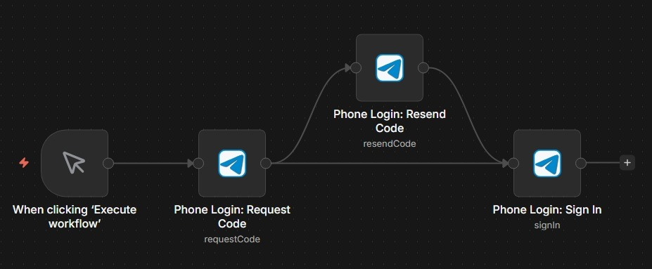
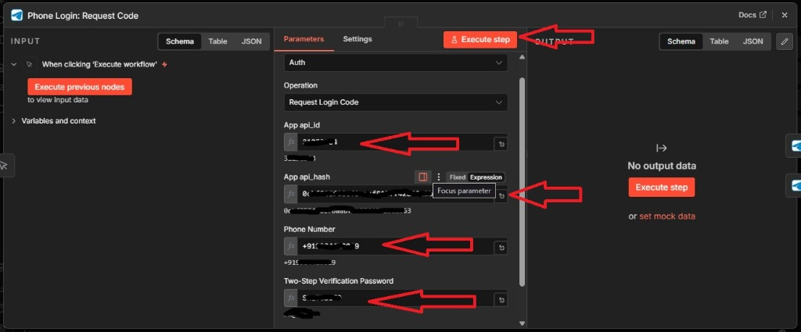
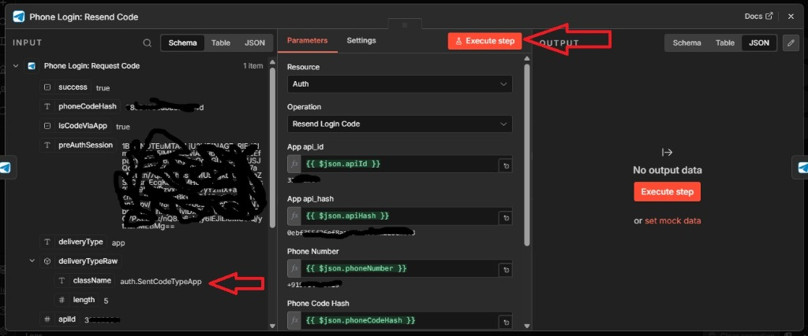
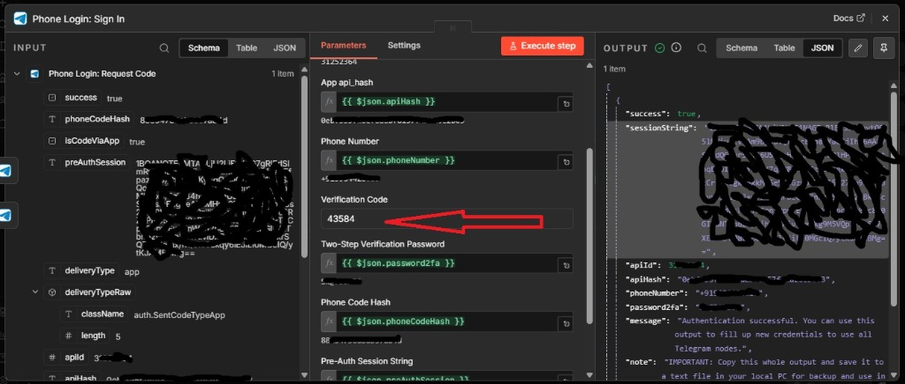
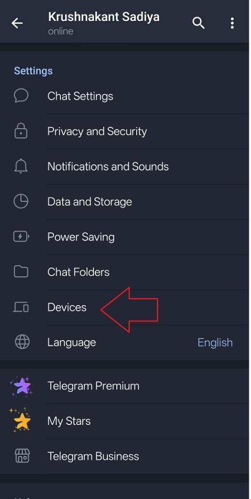
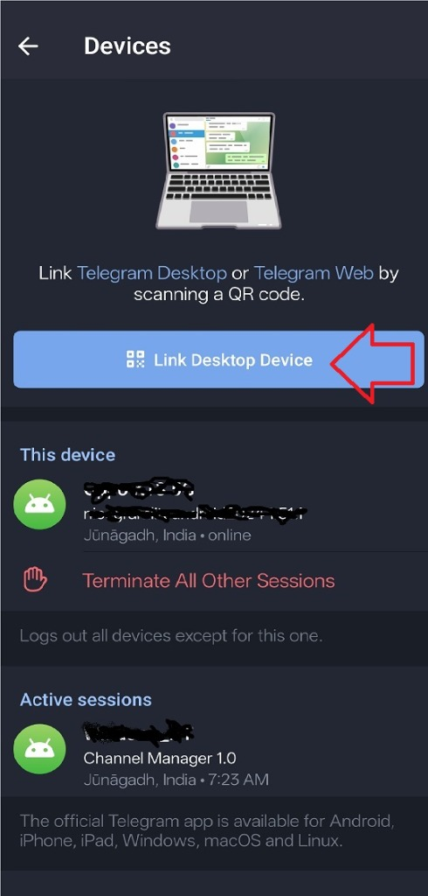
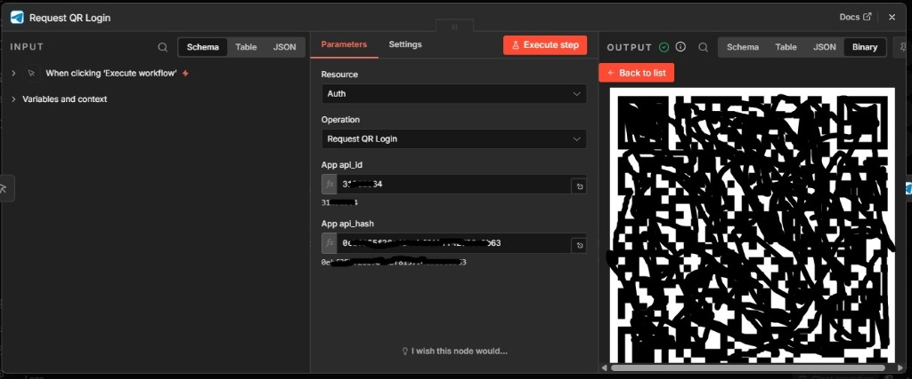
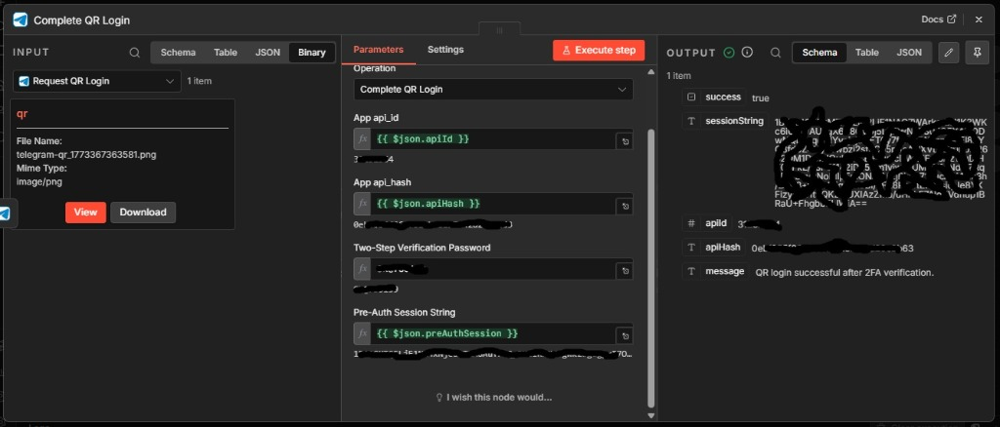

# Telegram GramPro - Authorization Guide

## Overview

This guide will help you authenticate your Telegram account with n8n using the Telegram Auth node. The process involves two operations that work together to generate a secure session string for use with other Telegram nodes.

## Prerequisites

Before starting, ensure you have:
- A Telegram account with access to your phone number
- API ID and API Hash from [https://my.telegram.org](https://my.telegram.org)
- Access to the phone number associated with your Telegram account
- Your mobile number with country code (e.g., +1234567890)
- Your 2FA password if your account has 2FA enabled

## Authentication Flow

---

## Phone Login (OTP Authentication)

The Phone Login method uses a One-Time Password (OTP) sent to your Telegram app or via SMS.

### Workflow Setup



For a complete setup, we recommend connecting the nodes as shown above. This allows you to easily pass the `phoneCodeHash` and `preAuthSession` between steps.


### Step 1: B1: Phone Login - Request Code



1.  Add a **Telegram Auth** node.
2.  Set Operation to **B1: Phone Login - Request Code**.
3.  Enter your **API ID**, **API Hash**, and **Phone Number** (international format).
4.  (Optional) Enter your **2FA Password** if enabled.
5.  **Execute the node**.

> [!NOTE]
> Telegram will prioritize sending the code to your active Telegram app. If you don't have the app open, check your SMS.

### Step 2: B2: Phone Login - Resend Code (Optional)



If you haven't received the code within 60 seconds, or if you need the code via SMS instead of the app, you can use the **Resend Login Code** operation.

1.  Add another **Telegram Auth** node.
2.  Set Operation to **B2: Phone Login - Resend Code**.
3.  Link the output from "B1: Phone Login - Request Code" to this node to automatically pass the **API ID**, **API Hash**, **Phone Number**, and **Phone Code Hash**.
4.  **Execute the node** to trigger a new delivery method.

### Step 3: B3: Phone Login - Sign in



Once you have the 5-digit verification code:

1.  Add a **Telegram Auth** node.
2.  Set Operation to **B3: Phone Login - Sign in**.
3.  Link the previous node's output to automatically populate the required hashes.
4.  Enter the **Verification Code** you received.
5.  **Execute the node**.

If successful, you will receive your **Session String** in the output JSON.

---

---

---

## QR Login (Recommended Fallback)

QR login is the most reliable way to authenticate when SMS delivery is restricted by your carrier or region. It bypasses the need for OTP codes entirely.

### Preparation

Ensure you have your Telegram app open on your mobile device.

1.  Open **Telegram** on your phone.
2.  Go to **Settings** > **Devices**.



3.  Tap on **Link Desktop Device**. This will open your camera for scanning.



### n8n Workflow Setup

Create a simple workflow with two Telegram Auth nodes:


### Step 1: A1: QR Login - Generate Code

1.  Add a **Telegram Auth** node to n8n.
2.  Set Resource to **Authentication** and Operation to **A1: QR Login - Generate Code**.
3.  Enter your **API ID** and **API Hash**. 
4.  **Execute the node**.

You will see a QR code generated in the **Binary** output tab:



5.  **Scan this QR code** immediately with your phone. 

> [!TIP]
> The QR code expires quickly (usually 30-60 seconds). Scan it as soon as it appears.

### Step 2: A2: QR Login - Authenticate

1.  Add another **Telegram Auth** node.
2.  Set Operation to **A2: QR Login - Authenticate**.
3.  Fill in the parameters (API ID, API Hash).
4.  **Pre-Auth Session String**: Pass the `preAuthSession` value from the output of Step 1.
5.  **2FA Password**: If you have Two-Step Verification enabled, enter your password here.
6.  **Execute the node**.

If successful, you will receive your **Session String**:



---

## Session String Handling

### Important Notes

**⚠️ CRITICAL**: When you receive the session string output:

1. **Copy the session string** from the output
2. **Save it to a text file** for backup purposes
3. **Restart your n8n instance** to prevent "Ghost Connection timeout" errors in the terminal logs

The session string is encrypted automatically when used with the main Telegram nodes. Restarting n8n after generating or replacing a session keeps trigger/action nodes on a clean shared MTProto client state.

## Phone Code Expiration - Quick Fix Guide

### Problem
The error `PHONE_CODE_EXPIRED` occurs when the verification code sent to your phone has expired before you complete the B3: Phone Login - Sign in operation.

### Why This Happens
- Telegram verification codes typically expire after **10-15 minutes**
- Network delays or slow workflow execution can cause expiration
- The code becomes invalid and cannot be used for authentication

### Solution

#### Immediate Fix
1. **Request a new code** using the B1: Phone Login - Request Code operation
2. **Complete the B3: Phone Login - Sign in operation immediately** (within 10 minutes)
3. **Use the new phoneCodeHash** from the fresh request

#### Best Practices to Avoid This Issue

**Quick Execution**:
- Run both operations back-to-back without delays
- Complete the entire authentication flow within 10 minutes

**Workflow Optimization**:
```
B1: Phone Login - Request Code → Store phoneCodeHash → Get Phone Code from SMS → B3: Phone Login - Sign in → Use Session String
```

**Error Handling**:
The updated node provides clear error messages:
```
"The verification code has expired. Please request a new code and try again."
```

### Step-by-Step Recovery

1. **Run B1: Phone Login - Request Code Operation**
   ```json
   {
     "operation": "requestCode",
     "apiId": 123456,
     "apiHash": "abcdef...",
     "phoneNumber": "+1234567890"
   }
   ```

2. **Get New phoneCodeHash**
   ```json
   {
     "phoneCodeHash": "new_hash_value...",
     "success": true
   }
   ```

3. **Immediately Run B3: Phone Login - Sign in Operation**
   ```json
   {
     "operation": "signIn",
     "apiId": 123456,
     "apiHash": "abcdef...",
     "phoneNumber": "+1234567890",
     "phoneCodeHash": "new_hash_value...",
     "phoneCode": "123456"
   }
   ```

4. **Get Session String**
   ```json
   {
     "sessionString": "your_session_string...",
     "success": true
   }
   ```

---

## New Authentication Features

### Enhanced Session String Generation

The updated authentication system now provides additional information in the session generation output:

```json
{
  "success": true,
  "sessionString": "123456:abcdef...",
  "apiId": 123456,
  "apiHash": "abcdef...",
  "phoneNumber": "+1234567890",
  "password2fa": "your-2fa-password",
  "message": "Authentication successful. Use the sessionString in your Telegram nodes.",
  "note": "IMPORTANT: Copy this sessionString output and save it to a text file for backup. Then restart your n8n instance to prevent \"Ghost Connection timeout\" errors in the terminal logs."
}
```

### Key Improvements

1. **Enhanced Error Messages**: More descriptive error messages for common issues
2. **Session Validation**: Better validation of session strings before use
3. **Connection Management**: Improved connection cleanup and management
4. **2FA Support**: Enhanced support for accounts with two-factor authentication
5. **Security Enhancements**: Automatic session encryption with AES-256-GCM
6. **Performance Optimization**: Faster authentication with reduced connection overhead

### Troubleshooting New Features

#### **"Session string generation failed" Error**
If you encounter issues with session string generation:

1. **Check Network Stability**: Ensure stable internet connection during authentication
2. **Verify 2FA Password**: If using 2FA, ensure correct password format
3. **Complete Quickly**: Finish authentication within the 10-minute window
4. **Restart n8n**: Always restart n8n after successful authentication

#### **"Ghost Connection timeout" Prevention**
To prevent connection timeout errors:

1. **Restart n8n**: Always restart n8n after receiving the session string
2. **Backup Session**: Save session string to a text file for backup
3. **Monitor Logs**: Check n8n logs for connection status
4. **Use Stable Network**: Avoid VPN/proxy during authentication

#### **"Session encryption failed" Error**
If session encryption fails:

1. **Verify API Credentials**: Ensure API ID and Hash are correct
2. **Check Session Format**: Session string should be properly formatted
3. **Network Issues**: Check for network connectivity problems
4. **Memory Issues**: Ensure sufficient memory for encryption operations

#### **"Connection pool exhausted" Error**
If connection pooling fails:

1. **Reduce Concurrent Operations**: Limit simultaneous authentication requests
2. **Check System Resources**: Ensure sufficient memory and CPU
3. **Monitor Connections**: Check for connection leaks in other workflows
4. **Restart Services**: Restart n8n and related services

## Integration with Other Nodes

The generated `sessionString` can be used directly with:

- **Telegram MTProto Node**: For all Telegram operations
- **Telegram Trigger Node**: For event-based workflows with MTProto listening

The trigger and action nodes now reuse the same cached Telegram client for the same account session. This reduces duplicate-session instability when a published workflow receives a trigger event and then sends or edits a message in the same execution.

## Security Features

### **AES-256-GCM Session Encryption**
- **Automatic Encryption**: Session strings are automatically encrypted using AES-256-GCM
- **Key Derivation**: Encryption keys are derived from your API credentials using PBKDF2
- **Authentication Tags**: Integrity verification with authentication tags
- **Secure Storage**: Encrypted sessions prevent unauthorized access

### **Enhanced Input Validation**
- **API Credentials**: Validates API ID format and Hash length
- **Phone Number**: Validates international format and length
- **Session String**: Validates format and integrity
- **2FA Password**: Validates format and security requirements

### **Connection Security**
- **Secure Password Handling**: 2FA passwords are handled securely
- **Session Encryption**: Generated sessions are compatible with the encryption system
- **Temporary Connections**: No persistent connections are maintained
- **Proper Cleanup**: All resources are properly cleaned up after use

### **Memory Management**
- **Automatic Cleanup**: Connection pools are automatically cleaned up
- **Resource Management**: Proper resource allocation and deallocation
- **Memory Optimization**: Prevents memory leaks and excessive usage
- **Background Processing**: Non-blocking operations for better performance

## Advanced Configuration

### **Environment Variables**
- `GRAMPRO_LOG_LEVEL=debug` - Enable detailed authentication logging
- `N8N_LOG_LEVEL=debug` - Fallback for authentication logs

### **Performance Tuning**
- **Connection Timeout**: Configure authentication timeout settings
- **Retry Logic**: Set retry attempts for failed authentications
- **Memory Limits**: Configure memory limits for encryption operations
- **Network Settings**: Optimize network settings for authentication

### **Security Best Practices**
1. **Secure Storage**: Always store session strings securely
2. **Regular Rotation**: Rotate session strings periodically
3. **Monitor Usage**: Monitor authentication attempts and usage
4. **Backup Strategy**: Maintain secure backups of session strings
5. **Access Control**: Limit access to authentication credentials

## Troubleshooting

### Common Issues

1. **"Code not sent"**: Check your phone number format and API credentials
2. **"Invalid phone code"**: Ensure you're using the correct code and phoneCodeHash
3. **"Phone code expired"**: The verification code has expired (typically after 10-15 minutes). Request a new code and try again.
4. **"2FA password required"**: Enter your 2FA password in the password2fa field
5. **"Session already in use"**: Disconnect other Telegram clients or wait for session timeout
6. **"Ghost Connection timeout"**: Restart your n8n instance after receiving the session string
7. **"Session encryption failed"**: Check API credentials and network connectivity
8. **"Connection pool exhausted"**: Reduce concurrent operations and check system resources

### Best Practices

1. **Store credentials securely**: Use n8n's credential management
2. **Handle errors gracefully**: Implement proper error handling in your workflows
3. **Monitor session usage**: Avoid multiple simultaneous authentications
4. **Keep API credentials safe**: Never expose them in workflow outputs
5. **Act quickly**: Complete the authentication process within 10-15 minutes to avoid code expiration
6. **Use fresh codes**: Always request a new verification code if the previous one expired
7. **Restart n8n**: Always restart n8n after session string generation to prevent connection issues
8. **Monitor Performance**: Watch for authentication performance and adjust settings as needed
9. **Security First**: Always prioritize security over convenience
10. **Regular Maintenance**: Periodically review and update authentication settings

## Example Complete Workflow

```
1. Telegram Auth (Request Login Code)
   ├── Input: API ID, API Hash, Phone Number
   └── Output: phoneCodeHash

2. [Manual Step: Enter verification code]

3. Telegram Auth (Complete Login)
   ├── Input: All parameters + phoneCode + phoneCodeHash (drag & drop from step 1)
   └── Output: sessionString

4. [IMPORTANT: Copy sessionString to text file and restart n8n]

5. Telegram MTProto Node
   ├── Input: Use sessionString in credentials
   └── Output: Telegram operations
```

## Advanced Authentication Scenarios

### **Multiple Account Management**
For managing multiple Telegram accounts:
1. Generate separate session strings for each account
2. Use different credential sets in n8n
3. Monitor session usage across accounts
4. Implement session rotation for security

### **High-Volume Authentication**
For applications requiring frequent authentication:
1. Implement connection pooling
2. Use session caching where appropriate
3. Monitor authentication performance
4. Optimize network settings

### **Enterprise Security**
For enterprise environments:
1. Implement session encryption at rest
2. Use secure credential storage
3. Monitor authentication logs
4. Implement audit trails
5. Regular security assessments

This guide provides a complete authentication solution for integrating Telegram into your n8n workflows with proper session management, enhanced security, and improved error handling. The new features provide better performance, security, and user experience while maintaining enterprise-grade reliability.

## Credential Verification Behavior (Updated)

- Credential Save/Test now performs real MTProto getMe verification using your API ID, API Hash, and Session String.
- If credentials are invalid, Save/Test fails with a mapped Telegram-specific error message.
- n8n global credentials UI may still display the generic success text Connection tested successfully even after real verification.

### Common Mapped Credential Errors
- AUTH_KEY_UNREGISTERED: Session invalid/expired. Re-run Auth > B3: Phone Login - Sign in or A2: QR Login - Authenticate.
- SESSION_REVOKED / SESSION_EXPIRED: Session revoked or expired. Re-authenticate.
- SESSION_PASSWORD_NEEDED: Account has 2FA enabled; provide password.
- FLOOD_WAIT_X: Wait for Telegram rate-limit window before retrying.
- NETWORK_TIMEOUT / ETIMEDOUT: Temporary network issue; retry.

